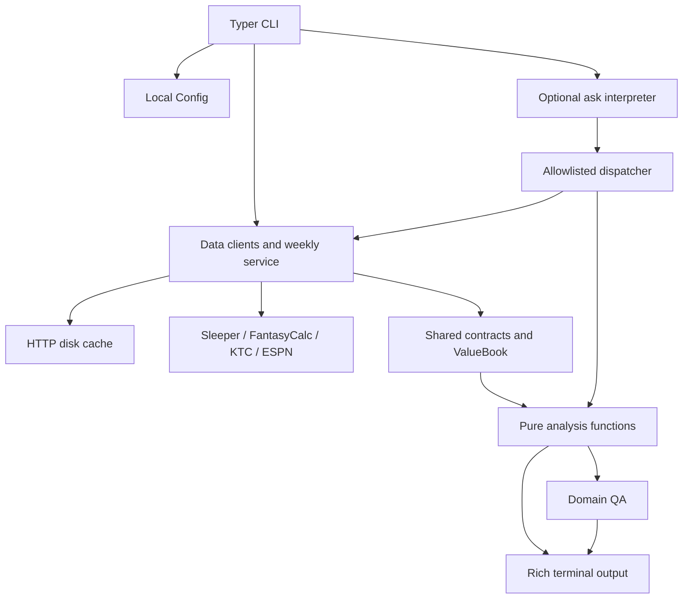

# System architecture

Repository-derived baseline inspected on 2026-10-05 against the `main` source snapshot at commit `5bd80cd397d516969c800849544e91751479ee50`. This describes the source being integrated on main, rather than a proposed architecture. Application source takes precedence when older prose differs. Provider behavior was inspected in source and fixtures; no live provider requests were made for this baseline.

## Package and runtime inventory

The application has one package manifest, `pyproject.toml`, and one dependency lockfile, `uv.lock`. The repository scan found no additional application package manifests, JavaScript frontend, database schema/migrations, ORM, Docker definition, hosted server, or deployment runtime configuration. Installed dependencies, Git internals, caches, and personal snapshots are outside the application inventory.

| Component | Declared compatibility | Version in `uv.lock` |
| --- | --- | --- |
| ff | Project version | 0.1.0 |
| Python | >=3.9; Ruff/mypy target 3.9; CI tests 3.9–3.12 | Interpreter is not pinned by the lockfile |
| Typer | >=0.12 | 0.23.2 |
| Pydantic | >=2,<3 | 2.13.4 |
| Requests | >=2.31 | 2.32.5 |
| Rich | >=13 | 15.0.0 |
| pytest / responses | >=8 / >=0.25 | 8.4.2 / 0.26.2 |
| Ruff / mypy | >=0.5 / >=1.10 | 0.16.8 / 1.19.1 |
| types-requests | >=2.31 | 2.32.4.20260107 |

The inspection interpreter was `.venv` Python 3.9.6; these direct dependencies matched the lockfile locally. This is an observation of this checkout, not an additional runtime requirement. Packaging uses `setuptools.build_meta`, with build requirements `setuptools>=61` and `wheel`, and discovers packages under `src/`. An auxiliary `scripts/calculator_oracle.mjs` requires Node 18+ (global fetch), with no npm dependencies or package manifest. It executes extracted provider JavaScript for live calculator parity checks; the application runtime remains Python. The installed entry point is `ff = ff.cli:app`. `make install` uses editable pip installation; CI uses `uv sync --frozen --extra dev`.

## Storage and authentication

There is no application database or database provider. State is local files plus in-memory snapshots:

| Store | Contract and lifecycle |
| --- | --- |
| `FF_HOME/config.json` | Pydantic `Config`: league ID, season, detected `Format`, user identity, names and LLM settings. Written by setup/onboarding and `config set-llm`; ordinary reads validate JSON. Config writes use `Path.write_text`, not the cache's atomic writer. |
| `FF_HOME/cache/` | URL-and-parameters SHA-256 cache keys truncated to 24 hex characters. JSON responses are cached as JSON; KTC stores raw HTML/text using the same cache-file mechanism. Entries are written through a temporary file and `os.replace`. |
| `FF_HOME/typesafe_api_key` | Optional TypeSafe key, stored separately from league config using an atomic replacement of a mode-0600 temporary file. An exported `TYPESAFE_API_KEY` takes precedence. |
| Memory | `ValueBook` indexes, lazy per-command context, QA's last report and Jev request metrics. No background service or persistent job queue. |
| `samples/` | Gitignored real-league inspection snapshots from `scripts/record_fixtures.py`; not the deterministic test fixtures or a production database. |

`FF_HOME` defaults to `Path.cwd() / ".ff"`; overrides expand `~`. Application state and credential contents were not inspected. `.gitignore` excludes `.ff/`, `typesafe_api_key`, and `samples/`; custom state roots require care because `.ff/` only names the default directory. `make clean` deletes the default `.ff` directory, including a saved key.

There is no sign-in/session system or user-auth provider. Sleeper user IDs select a fantasy roster; they do not authenticate ownership or authorize mutations. Sleeper, FantasyCalc, KTC and ESPN reads use public feeds. Optional TypeSafe requests use Bearer API-key authentication. Local terminal AI binaries rely on their own installation/account configuration; ff does not implement those providers' authentication.

## Module boundaries

| Layer | Files | Responsibility |
| --- | --- | --- |
| Boundary/orchestration | `src/ff/cli.py` | Typer arguments, config loading, client calls, lazy analysis context, team selection, Rich tables, QA invocation and expected-error handling. Includes `compare`, weekly waivers and the hidden `doctor` alias. |
| Shared contracts | `src/ff/contracts/models.py` | Pydantic domain models for assets, rosters, trades, picks, cleanup, draft fit, weekly context, lineups, comparisons, waivers, offer verdicts and news. `Config`, QA and Jev transport models live in their corresponding modules. |
| Infrastructure | `src/ff/core/config.py`, `http.py` | Local state paths/config, cached retrying JSON GETs and browser-User-Agent text GETs with TLS-only curl fallback; no football calculations. |
| Data clients | `sleeper/client.py`, `values/client.py`, `values/ktc.py`, `projections/client.py` | Fetch and normalize provider data. `values/normalize.py` shares player/pick normalization. `values/dealer.py` is a backward-compatibility adapter to KTC, not another active provider. `values/calculators_live.py` checks provider calculator bundle identities/formula fingerprints before trusting the direct trade offer rule. |
| Weekly orchestration | `src/ff/services/weekly.py` | Cross-provider schedule validation, fresh per-player availability, matchup joins and UTC observation time. Builds `WeeklyContext`; recommendation calculations stay in analysis. |
| Analysis | `src/ff/analysis/` | Deterministic calculations over contracts, metadata and `ValueBook`: roster valuation, trades, picks, opportunity, draft fit, lineup assignment, comparisons, weekly waivers and cleanup (including IR moves). `analysis/calculators.py` ports site trade adjustments and holds pure source-fingerprint helpers; it performs no network I/O. Existing imports of Sleeper's pure name helper and `ValueBook` do not introduce network calls here. |
| Optional interpretation | `src/ff/services/llm/` | Local terminal runner or bounded TypeSafe Jev classification, allowlisted tool dispatch and output rendering. |
| Validation | `src/ff/qa/` | Domain invariants and reports. QA is a mathematical/structural check, not proof of feed freshness, model accuracy or recommendation quality. |

## Data flow

1. **Setup to store:** `ff setup <username>` resolves the public Sleeper user, selects a league (explicit ID, zero-based index or interactive choice), fetches settings, calls `detect_format`, validates/builds `Config`, and saves `config.json`. Non-interactive onboarding saves only with one league or an explicit matching ID. Setup derives format from Sleeper rather than asking the user for scoring settings.
2. **Structured analysis:** a command parses arguments, loads config, requests only needed datasets and normalizes them. Sleeper rosters/users become `Roster`; FantasyCalc records become `Asset` and `ValueBook`. FantasyCalc's `player.sleeperId` joins directly to roster IDs; secondary values join by ID or normalized name/pick. Analysis returns models/collections and the boundary renders tables. Most commands render their result before running/rendering the QA footer, so strict QA is not a universal pre-render gate.
3. **Cache to provider:** `get_json` serves a fresh cache entry or performs GET with a 30-second timeout and up to four urllib3 retries for 429/500/502/503/504. Invalid/unreadable cached JSON is ignored and refetched. Default TTL is one hour; `ttl=0` bypasses freshness but still writes a successful response when caching is enabled. `ttl=None` keeps cached data indefinitely. KTC uses `get_text`, a shared text-fetch path with browser User-Agent and curl fallback on Requests TLS errors, without JSON-session retry handling. KTC values normally cache six hours; failures degrade to absent secondary values. Calculator HTML is fetched fresh and changed content/version-addressed bundles cache indefinitely.
4. **Weekly advice:** direct lineup refreshes league, rosters, state and projections. When the requested season/week matches fresh Sleeper state, `load_weekly` cross-checks Sleeper's schedule with ESPN's regular-season scoreboard, refreshes each owned player's status, and verifies roster/matchup starter alignment. `_prepare_weekly` supplies the shared current-week path for comparisons, weekly waivers and dispatched weekly tools; it also rejects a stale configured season. Weekly waiver snapshots include embedded projection metadata for unrostered candidates. Analysis freezes live/completed or unknown-timing assignments, uses actual scores for locked players, excludes taxi/IR and unavailable players, and produces conditional injury substitutions. Current week is `max(1, state.week, state.display_week)` through `_current_week`; neither state field alone determines the open slate. Other-week direct lineup requests are explicitly projection-only scenarios.
5. **Picks/draft:** future ownership is default pick endowment reconciled with traded picks; the last re-trade row wins. Prices use the original team's rank to choose early/mid/late tiers. Future pick windows use league rookie draft rounds before falling back to draft settings. Live draft orchestration fetches the individual draft endpoint for `slot_to_roster_id`, excludes drafted/rostered assets and applies roster-relative fit scores. The generic `get_draft_fit` dispatcher ranks the unrostered pool; it does not fetch the live draft board itself.
6. **Local `ask`:** backend resolution checks `agy`, `gemini`, `claude`, then `ollama` in PATH. A print/headless subprocess (120-second timeout) returns Markdown or a JSON `{tool, kwargs}` call. Only registered tool names dispatch. The same analysis context supplies deterministic results; a second runner call receives those results for prose synthesis. Local interpretation schemas are advertised to the model, but dispatch does not globally validate kwargs against them.
7. **Jev `ask`:** explicitly selected `jev` makes one logical POST of the question and fixed Choice classification questions, without appended league data. Only HTTP 429/529 retry, at most twice (one/two-second delays; 15-second request timeout). Local code verifies answers, confidence and supported details, resolves exact named teams/roster numbers or the saved owner identity, builds kwargs, then dispatches existing analysis. Its tables are rendered without another prose model or secondary-market scrape. Unsupported/uncertain requests clarify with exit 3; service failures exit 1, with no fallback.

## Providers and freshness

| Provider | Boundary | Normal freshness / purpose |
| --- | --- | --- |
| Sleeper public v1 | `https://api.sleeper.app/v1` | State/user/leagues, rosters/users/matchups, traded picks, drafts, player catalog and trending. League data 30 minutes; catalog 24 hours; trending/state typically one hour; draft and matchup reads TTL 0. Fresh state/league/roster flags use TTL 0. |
| Sleeper player/projection/schedule feeds | `https://api.sleeper.com` | Per-player status TTL 0, news five minutes; projections three hours normally and TTL 0 for fresh decisions; schedule TTL 0. Raw projected stat lines are scored with league rules, not provider precomputed PPR points. |
| FantasyCalc | `https://api.fantasycalc.com/values/current` | Six-hour values normally; direct trade uses fresh values. Parameters are `isDynasty`, `numQbs`, `numTeams`, `ppr`, plus optional `tep=te+`/`te++`. |
| KeepTradeCut | `https://keeptradecut.com/trade-calculator` | Embedded JSON in `script#ktc-players` (legacy `playersArray` and raw JSON also supported), six-hour text cache, superflex/1QB plus nested TE+/TE++ values. Optional and allowed to degrade; direct trade fetches fresh. |
| ESPN | `https://site.api.espn.com/apis/site/v2/sports/football/nfl/scoreboard` | TTL 0; season/year/week and opponent-pair verification against Sleeper schedule before trusting kickoff/status. |
| TypeSafe | `https://api.typesafe.ai/v1/systemone` | Optional paid Jev classification. Default `jev-1.13.0`, overridable by `TYPESAFE_MODEL`; confidence floor 0.80. No disk response cache. |

## Valuation, cleanup and auxiliary flows

`Format` detects both `tep` and dedicated `te_slots`. FantasyCalc sends `tep=te++` for two or more dedicated TE slots or premium above 1.0, `te+` for premium at least 0.5, and otherwise omits the parameter. KTC uses aligned tiers to select nested `tep`/`tepp` values. Premiums below the supported cut points remain visibly qualified; lineup still scores raw reception-bonus keys exactly once.

Direct `ff trade` fetches both markets fresh, keeps fetch times/format/KTC top value and HTML in `ValueBook`, applies each site's package adjustment in pure analysis, and displays raw versus adjusted totals. `TradeEvaluation` retains unresolved tokens, adjustment state and approximate-price flags. The default offer rule passes only with a gap strictly below 10% of the larger side in both markets and KTC's own Fair Trade judgment. Missing or approximate prices, unresolved assets, redraft, failed adjustment solves or calculator drift produce `OfferVerdict(status="CANNOT_JUDGE", reasons=[...])`. Raw position deltas do not include package adjustments. Generic `evaluate_trade` dispatch performs adjustments but does not itself do the direct CLI fresh-fetch/drift-check/offer-rule orchestration.

`values/calculators_live.py` reads FantasyCalc's calculator page fresh and compares content-hashed main/chunk names with pinned fingerprints. Changed bundles are downloaded and their formula constants/normalized hashes checked. KTC's version comes from already fetched value HTML; changed `site.min.js?v=...` is similarly checked. These are outbound text calls, not server routes. The Node oracle verifies ports against actual site code and golden vectors; current pinned fingerprints are historical verification inputs, not fresh evidence from this documentation task.

Arbitrage movers preserve raw FC/KTC numbers but compare ranks: `secondary_scaled` is the FC value at the corresponding KTC rank, averaging tied ranks. `diff` uses that restated value, so it is not raw KTC minus FC. Generic future pick labels use Mid KTC prices as flagged approximations; exact requested tiers retain their own KTC values. Offer checks refuse to treat such stand-ins as exact prices.

Cleanup shares `designation` and `ir_eligible_statuses` with weekly verification. It recommends active-to-IR moves only for league-permitted designations, capped by open IR slots, ordered by expected absence then value/name, and excludes Coach's Decision scratches. Recommended IR moves and taxi moves do not duplicate a player. Clearing an IR designation can block later Sleeper changes until the occupant returns to the active roster.

`scripts/find_offers.py` is a separate read-only offer search, not an `ff` command: it loads live markets, validates calculator parity, resolves selected managers' owned players and tiered future picks, enumerates packages with at most one owned balancer and retains passing offers. It ranks incoming young need-filling value, lineup improvement, counterparty win-now gain and gap closeness, with role/injury/trend flags. CBS ranking links in `docs/expert-ranking-sources.md` are manual references, not a scraped/authenticated provider or automatic projection override.

## Runtime controls and limits

`FF_HOME` selects file state; `FF_QA` selects off/summary/verbose/strict (default off still runs checks and displays failures); `TYPESAFE_API_KEY` and `TYPESAFE_MODEL` configure Jev. `FF_LIVE_LEAGUE_ID` belongs to optional integration canaries, not ordinary runtime configuration. Saved `llm_backend` defaults to `auto` and `ollama_model` to `llama3.2`. `auto` never chooses Jev. Current local runners do not include a Codex binary despite older repository prose mentioning it.

Weekly gates reject best-ball, AutoSubs, invalid/unverified IR eligibility, excess active capacity/capacity override and unsupported lineup slots. Unknown player timing is frozen/excluded rather than assumed safe; questionable/doubtful designations remain conditional. Current week uses the later of Sleeper `week` and `display_week`, never below one; it is not derived from a calendar. The schedule and player/news feeds are partly undocumented and require live canaries for upstream drift. No command submits claims, places bids, adds/drops players, changes lineups or executes trades.

Sources: `pyproject.toml`, `uv.lock`, `Makefile`, `.github/workflows/ci.yml`, `.githooks/pre-commit`, `.gitignore`, `src/ff/cli.py`, `src/ff/core/`, `src/ff/contracts/models.py`, `src/ff/sleeper/client.py`, `src/ff/values/`, `src/ff/projections/client.py`, `src/ff/services/weekly.py`, `src/ff/services/llm/`, `src/ff/qa/`, `tests/test_live.py`. See `api-contracts.json` for callable inputs, model schemas and failure behavior; see `coding-guardrails.md` for change constraints and verification gates.
