# ff

[](https://github.com/savvides/ff/actions/workflows/ci.yml)
[](LICENSE)

A command-line tool for managing a Sleeper dynasty fantasy football league —
rankings, trade analyzer, multi-market arbitrage, roster valuation, power rankings,
lineup optimizer, waiver targets, injury tracking, and live draft board.

## Why a CLI

- **Fast** — no page loads, no ads, answers in milliseconds from local disk cache.
- **Scriptable** — pipe it, cron it, wire it into your own tools.
- **Yours** — runs locally, reads only public league data, zero account or tracking.
- **Hackable** — pure Python, small typed contracts between modules, easy to extend.

**Data sources (all free, no account, read-only):**
- [Sleeper API](https://docs.sleeper.com/) — league settings, rosters, matchups, transactions, trending adds, injuries, and player news.
- Sleeper projections (`api.sleeper.com`) — weekly projected stat lines (RotoWire), scored by your league's own rules for the lineup optimizer.
- [FantasyCalc API](https://fantasycalc.com/) — dynasty values for players **and draft picks**, tagged with `sleeperId` so they join straight onto your roster.
- [KeepTradeCut](https://keeptradecut.com/) — crowdsourced secondary market values, joined against FantasyCalc to identify arbitrage opportunities.
- Local LLM Runners (`agy`, `gemini`, `claude`, `ollama`) — terminal AI agents executing deterministic Python tools for plain-English Q&A.

## Architecture

Data flows unidirectionally across clear module boundaries:

```mermaid
flowchart TD
    subgraph DataSources["Free & Public Data Sources"]
        Sleeper["Sleeper API\n(League, Rosters, Picks, News, Trends)"]
        SleeperProj["Sleeper Projections API\n(Weekly Stat Lines)"]
        FantasyCalc["FantasyCalc API\n(Dynasty & Redraft Trade Values)"]
        KTC["KeepTradeCut\n(Secondary Market Values)"]
        LLM["Local LLM CLI\n(agy / gemini / claude / ollama)"]
    end

    subgraph CoreEngine["ff Core & Caching Layer"]
        Http["core/http.py\n(Disk-cached & retrying JSON client)"]
        Config["core/config.py\n(.ff/config.json)"]
        SleeperClient["sleeper/client.py\n(Format detection & roster builder)"]
        ValuesClient["values/client.py & ktc.py\n(ValueBook with ID/Name/Pick lookup)"]
        ProjClient["projections/client.py\n(Raw weekly stat lines)"]
        LLMRunner["services/llm/\n(TerminalRunner & Tool Dispatcher)"]
    end

    subgraph Contracts["Typed Domain Contracts"]
        Models["contracts/models.py\n(Domain models: Asset, TradeEvaluation, RosterValuation, Format)"]
    end

    subgraph PureAnalysis["Pure Analysis Engine (No I/O)"]
        RosterAnalysis["analysis/roster.py\n(value_all_rosters)"]
        PicksAnalysis["analysis/picks.py\n(pick_ledger & price_pick)"]
        TradeAnalysis["analysis/trade.py\n(analyze_trade & arbitrage)"]
        MoversAnalysis["analysis/movers.py\n(top_movers & find_arbitrage)"]
        LineupAnalysis["analysis/lineup.py\n(optimal_lineup - greedy laminar)"]
        CleanupAnalysis["analysis/cleanup.py\n(audit_roster & taxi eligibility)"]
        FitAnalysis["analysis/fit.py & draft.py\n(FitScore & team-relative draft)"]
        WaiversAnalysis["analysis/waivers.py\n(waiver_targets)"]
    end

    subgraph QALayer["Post-Command Invariant Verification & Telemetry"]
        QAEngine["qa/engine.py & qa/validators.py\n(Post-command domain invariant verifications & telemetry)"]
    end

    subgraph CLI["Rich Terminal Interface (cli.py)"]
        OutputSetup["ff setup / config"]
        OutputValuation["ff roster / power / picks / values"]
        OutputTrading["ff trade / movers"]
        OutputManagement["ff lineup / cleanup / news / waivers"]
        OutputDraft["ff draft / ask"]
        OutputQA["ff qa / version"]
    end

    DataSources --> CoreEngine
    CoreEngine --> Contracts
    Contracts --> PureAnalysis
    PureAnalysis --> CLI
    CLI --> QALayer
```

## Quickstart

```bash
make install                 # venv + deps + pre-commit hook
./.venv/bin/ff setup <your-sleeper-username>
./.venv/bin/ff power
./.venv/bin/ff roster
./.venv/bin/ff values -p WR --market dealer
./.venv/bin/ff lineup                 # optimal start/sit for the current week
./.venv/bin/ff trade --give "Jahmyr Gibbs, 2026 2nd" --get "Bijan Robinson, 2027 1st" --market both

./.venv/bin/ff movers --arbitrage
./.venv/bin/ff news
./.venv/bin/ff cleanup
./.venv/bin/ff waivers
./.venv/bin/ff ask "Should I trade Jahmyr Gibbs and a 2026 2nd for Bijan Robinson?"
./.venv/bin/ff qa
```

`setup` reads your league's settings from Sleeper and **auto-detects the format**
(superflex/1QB, PPR, team count, TEP), so values are always calibrated for your league.
Picks are first-class assets: `2027 1st`, `2026 2nd`, `2026 Pick 1.05`, `2027 early 1st` all resolve automatically.

---

## Command Reference & Workflows

### 1. League Setup & Configuration

#### `ff setup <username>`
Discovers your leagues, resolves your team, auto-detects league scoring format (superflex, PPR, team count, tight-end premium), and saves `.ff/config.json`.

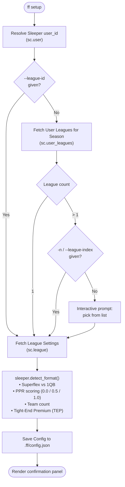

**Options:**
- `username`: Your Sleeper username (positional).
- `--season Y`: Target season year (defaults to active/current season).
- `--league-id ID`: Skip interactive selection and bind directly to a specific Sleeper league.
- `-n, --league-index N`: Pick the Nth league non-interactively (0-indexed from the printed list).

---

#### `ff config set-llm <backend>`
Configures the local LLM runner used by `ff ask`.

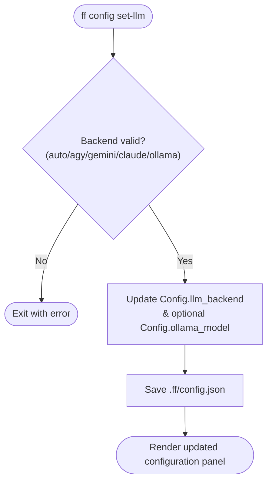

**Options:**
- `backend`: Runner backend (`auto`, `agy`, `gemini`, `claude`, `ollama`).
- `-m, --model M`: Model name when using Ollama (defaults to `llama3.2`).

---

### 2. Roster Valuation & League Standings

#### `ff roster [team]`
Prices out an entire roster using live market values. Computes total dynasty value, power rank, starters value, positional breakdown, and top individual assets with injury tags and 30-day value trends.

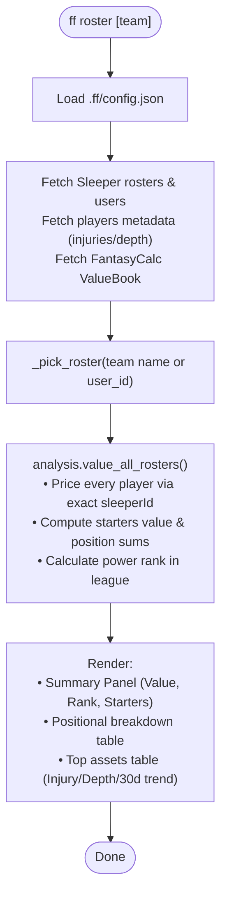

**Options:**
- `team`: Optional team name search (defaults to your own roster).
- `--top N`: Number of top assets to display in detail (default: 15).

---

#### `ff power`
Generates league-wide power rankings by total dynasty player value, paired with current W-L records and total points scored.

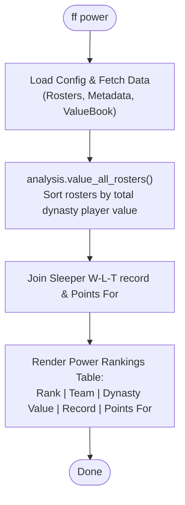

**Options:**
- Takes no options (ranks all rosters league-wide).

---

#### `ff picks [team]`
Reconciles whole-team draft capital ownership across all trades, applying power-ranked tier valuation (Early, Mid, Late) to 1st and 2nd round picks.

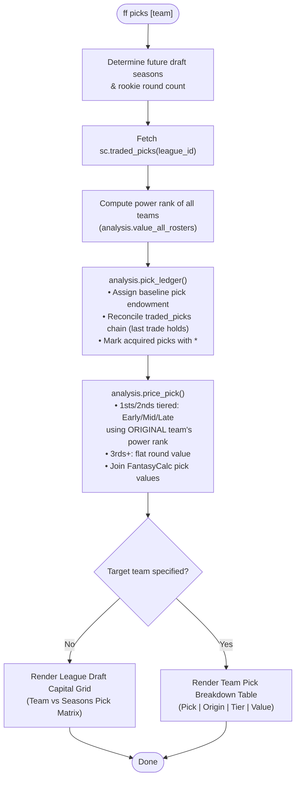

**Options:**
- `team`: Team name search (omit to view full league draft capital grid).
- `--years N`: Number of future draft classes to show (default: 2).
- `--rounds N`: Rookie rounds per draft (overrides league setting auto-detection).

---

### 3. Market Analysis & Trade Engine

#### `ff values`
Dynasty rankings calibrated to your league's exact settings, supporting dual-market views (FantasyCalc + KeepTradeCut) and positional filters.

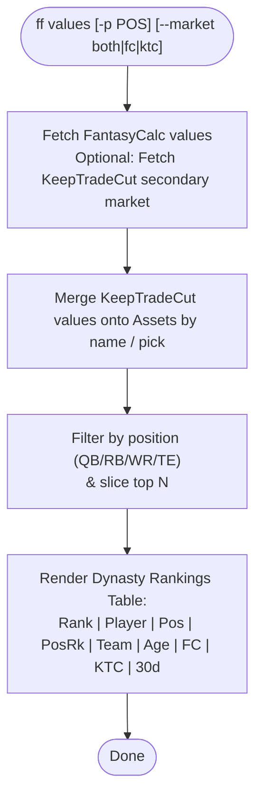

**Options:**
- `-p, --position POS`: Filter by `QB`, `RB`, `WR`, or `TE` (omit for overall).
- `-m, --market MARKET`: Market source: `both` (default), `fc` (FantasyCalc), or `ktc` (KeepTradeCut). Accepts `dealer` as an alias.
- `--limit N`: How many assets to show (default: 40).

---

#### `ff trade --give --get`
Multi-market trade analyzer supporting players and draft picks. Evaluates net values, fairness thresholds, positional balance swings, and market arbitrage opportunities.

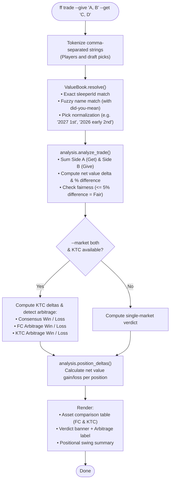

**Options:**
- `--give ASSETS`: Comma-separated assets you send (e.g. `--give "Jahmyr Gibbs, 2026 2nd"`).
- `--get ASSETS`: Comma-separated assets you receive (e.g. `--get "Bijan Robinson, 2027 1st"`).
- `-m, --market MARKET`: Valuation model: `both` (default), `fc` (FantasyCalc), or `ktc` (KeepTradeCut). Accepts `dealer` as an alias.

---

#### `ff movers`
Identifies high-leverage trade targets: buy-low / sell-high candidates (dynasty vs win-now redraft value gaps) and cross-market arbitrage opportunities (FantasyCalc vs KeepTradeCut discrepancies).

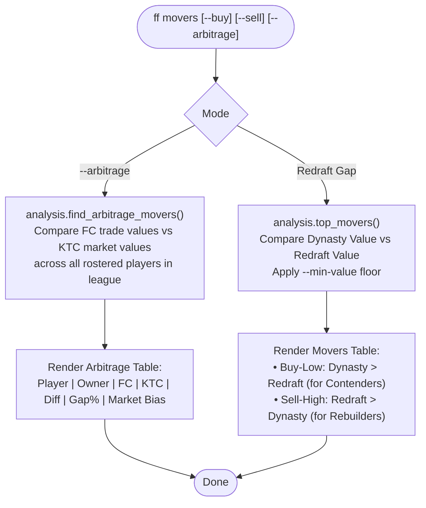

**Options:**
- `--buy`: Show buy-low candidates (dynasty value > redraft value; or KTC > FC for arbitrage).
- `--sell`: Show sell-high candidates (redraft value > dynasty value; or FC > KTC for arbitrage).
- `-a, --arbitrage`: Scan for pricing inefficiencies between FantasyCalc and KeepTradeCut across league rosters.
- `--min-value N`: Floor on both values; filters out deep stashes (default: 1000).
- `--limit N`: Max results to display (default: 20).

---

### 4. Roster Management & Gameday

#### `ff lineup [team]`
Lineup optimizer scoring weekly stat projections against your league's exact rules (including TEP), using an optimal laminar greedy assignment algorithm, and providing actionable START/SIT deltas vs your current Sleeper starters.

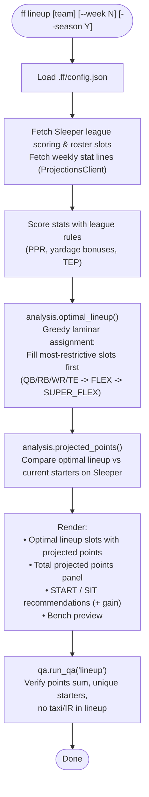

**Options:**
- `team`: Team name search (defaults to your team).
- `--week N`: Target NFL week (defaults to active/upcoming week).
- `--season Y`: Target season year (defaults to your league's configured season).

---

#### `ff cleanup [team]`
Roster auditor that computes active, taxi, and IR capacity, ranking drop candidates (lowest value non-starters first) and highlighting zero-loss taxi stashes to open active room for waiver adds.

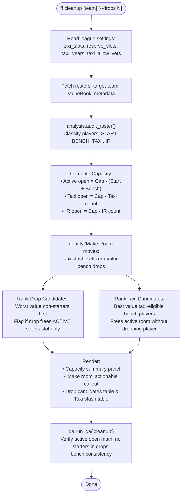

**Options:**
- `team`: Team name search (defaults to your team).
- `--drops N`: How many drop candidates to list (default: 8).

---

#### `ff news [team]`
Tracks player health, injury designations, depth-chart roles, and Sleeper 24-hour trending adds/drops across your league or for a specific team.

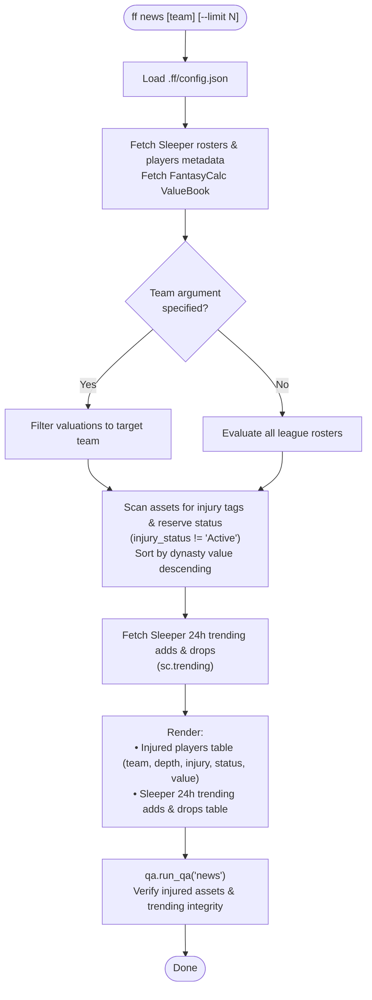

**Options:**
- `team`: Filter injuries to a specific team (omit for league-wide).
- `--limit N`: Number of trending adds and drops to display (default: 15).

---

#### `ff waivers`
Identifies trending free-agent adds across Sleeper, joins them with FantasyCalc dynasty values, and flags their availability in your league.

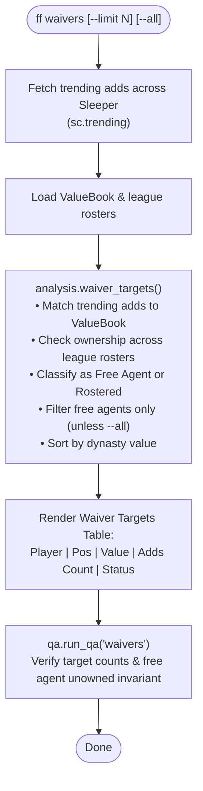

**Options:**
- `--limit N`: How many waiver targets to show (default: 20).
- `--all`: Include currently rostered players (default: free agents only).

---

### 5. Live Draft Board & Natural Language AI

#### `ff draft`
Live draft board scored specifically for YOUR team: tracks draft order (snake, linear, 3RR), owned picks and on-the-clock status, positional standings vs league median, and ranks best available players by `FitScore` (market value adjusted for your roster need and competitive horizon).

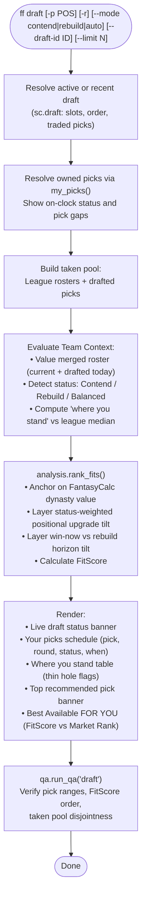

**Options:**
- `-p, --position POS`: Filter available board to `QB`, `RB`, `WR`, or `TE`.
- `-r, --rookies`: Show available rookies only.
- `--mode MODE`: Competitive horizon: `auto` (reads power rank), `contend`, or `rebuild` (default: `auto`).
- `--draft-id ID`: Manually specify or override draft ID.
- `--limit N`: Number of available players to display (default: 30).

---

#### `ff ask "<query>"`
Natural language Q&A interface using your terminal's local AI runner (`agy`, `gemini`, `claude`, `ollama`) to execute deterministic Python analysis tools and synthesize plain-English explanations.

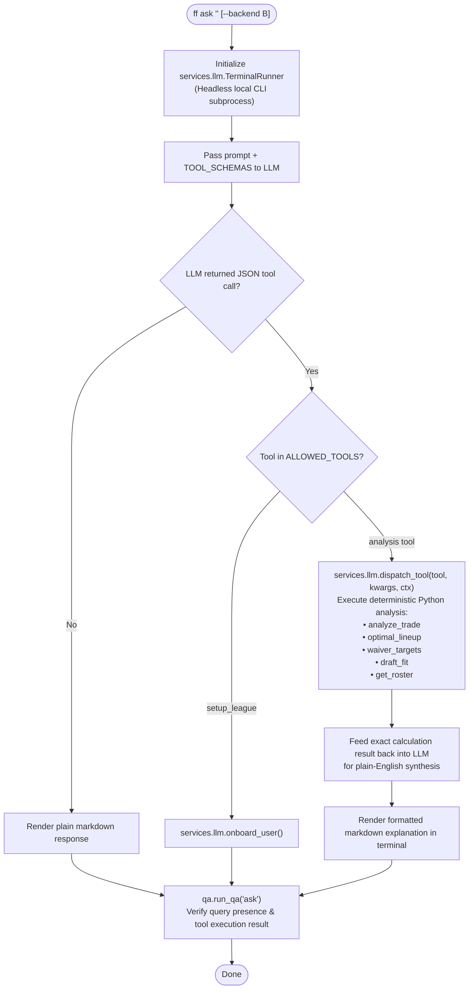

**Options:**
- `query`: Natural language question (e.g. `"Should I trade Gibbs for Bijan?"`, `"Who should I start at FLEX?"`).
- `--backend BACKEND`: Override LLM backend: `auto`, `agy`, `gemini`, `claude`, or `ollama`.

---

### 6. Diagnostics & Utilities

#### `ff qa`
Runs full-system diagnostic invariant audits across all league domains (setup configuration, roster valuations, power rankings, future draft pick ledger, market value books, roster cleanup capacity, trending waiver wire targets, and market arbitrage).

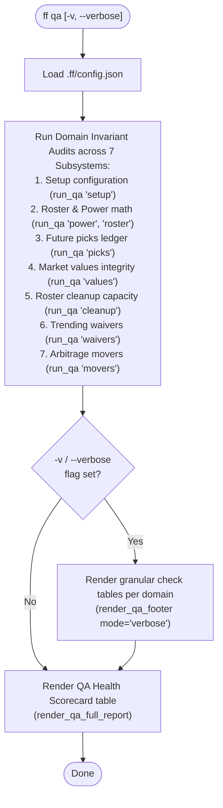

**Options:**
- `-v, --verbose`: Show granular check-by-check inspection tables for every audited domain.

---

#### `ff version`
Prints the installed version of `ff`.

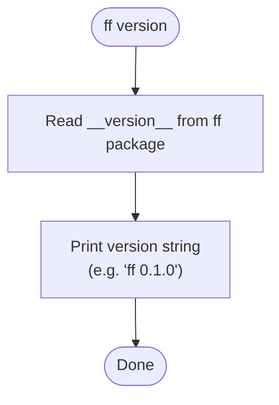

**Options:**
- Takes no options.

---

## Post-Command QA & Invariant System

`ff` features a built-in automated QA validation engine (`ff.qa`) that executes domain-specific mathematical and logical invariant checks after every command run.

### Telemetry & Modes (`FF_QA`)

Control post-command QA telemetry output via the `FF_QA` environment variable:

| Mode | Configuration Values | Output Behavior |
|---|---|---|
| **Silent** (default) | `FF_QA=0`, `FF_QA=off`, or unset | Runs invariant checks silently in background; surfaces a subtle warning only if invariant failures occur. |
| **Summary** | `FF_QA=1`, `FF_QA=summary`, `true`, `on` | Prints a concise 1-line check verification footer (e.g. `✔ QA: 5 checks passed (0.4ms)`). |
| **Verbose** | `FF_QA=verbose`, `FF_QA=detail` | Renders a detailed Rich inspection table displaying every individual check, pass/warn/fail status, and diagnostic messages. |
| **Strict** | `FF_QA=strict` | Raises `QAInvariantError` and immediately halts execution if any invariant failure is detected. |

### Standalone Health Check (`ff qa`)

Run `ff qa` anytime to perform an exhaustive, multi-domain invariant audit across setup, rosters, power rankings, future draft picks, market values, cleanup capacity, trending waivers, and market arbitrage. Add `--verbose` (`-v`) for granular check-by-check breakdown tables across every audited domain.

## Development

```bash
make test          # gate suite — offline, deterministic, < 2s
make test-live     # contract checks against the real APIs
FF_LIVE_LEAGUE_ID=<a completed league id> make test-live   # also runs traded-picks + draft-shape canaries
./.venv/bin/pytest tests/test_trade.py::test_trade_with_players_and_picks   # run single test
```

See [`CLAUDE.md`](CLAUDE.md) for architecture details and module contracts.

## Limits (by design)

- **`roster` and `power` value rostered players only**, not draft picks. Whole-team pick ownership is reconciled from `traded_picks` and tier-valued by `ff picks` — kept out of roster/power totals on purpose so player value and draft capital stay separately legible.
- **Lineup projections are single-source** (RotoWire, via Sleeper) and exclude K/DEF unless your league starts them. TEP *is* applied here because `lineup` scores raw projected stats with your league's settings — only FantasyCalc *dynasty values* (`values`/`roster`/`trade`) are not TEP-adjusted.
- **No trade *finder* and no tiers/VORP yet.** `trade` evaluates a deal you specify; it does not scan the league to propose one. Rankings are raw value without tier breaks or league-wide replacement level.

## Contributing

See [`CONTRIBUTING.md`](CONTRIBUTING.md) for developer environment setup, test lanes, and PR expectations.

## License

MIT — see [`LICENSE`](LICENSE).

