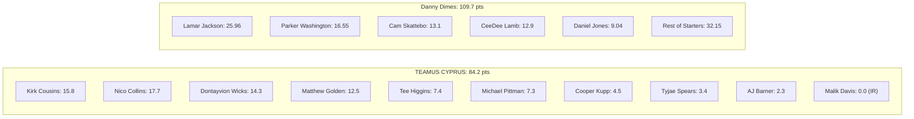
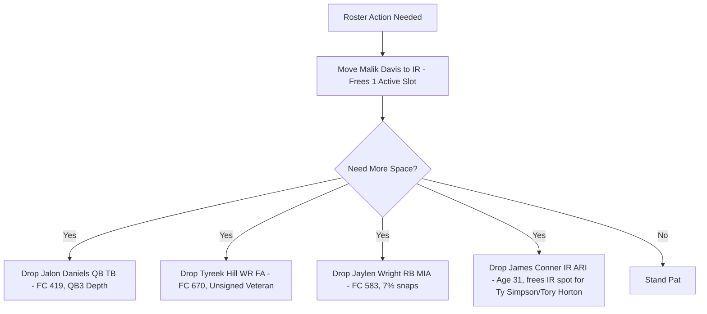

# Week 1 Report: Team Standing & Waiver Wire Intelligence

**League:** Montucky Cold Snacks World Championship League (12-Team Dynasty Superflex, 2 QB, 0.5 PPR, +0.5 TEP)  
**Team:** TEAMUS CYPRUS (`philippos`)  
**Timestamp:** Monday, September 14, 2026 (MNF: Denver Broncos @ Kansas City Chiefs remaining)

---

## 1. Executive Summary

| Dimension | Current State | League Context | Outlook |
| :--- | :--- | :--- | :--- |
| **Week 1 Result** | **84.2 pts** (Matchup Final) | Opponent: Danny Dimes (109.7 pts) | **0–1 Start** (Deficit: 25.5 pts) |
| **Week 1 Scoring Rank** | **#11 of 12** (could slip to #12) | League High: 178.7 (Thee Mojo Moments) | Bottom-tier weekly production |
| **Dynasty Roster Value** | **35,852** (Rank #12 / 12) | League Median: ~52,300 | Rebuilding foundation |
| **Draft Capital Value** | **20,058** (**Rank #1 / 12**) | 2x 2027 1sts, 2x 2028 1sts, 3x 2028 2nds | **Elite league-leading draft stockpile** |
| **FAAB Remaining** | **$182 / $200** | $18 used | Above-average purchasing power |
| **Roster Spots** | **20/20 Active (Full), 5/5 Taxi, 2/3 IR** | **1 Open IR Slot Available** | **Immediate free roster add via IR move** |

> [!IMPORTANT]
> **Zero-Cost Roster Fix:** You started **Malik Davis** (RB, DAL) in Week 1, who was inactive and on NFL **IR** (scoring **0.0 pts**). Because your league reserves 3 IR slots and you currently only have 2 filled (Trey Benson, James Conner), you can **immediately shift Malik Davis into IR**. This frees an active roster spot for Week 1 waivers **without dropping a single player**.

---

## 2. Week 1 Matchup Review & Team Standing

### Matchup 6 Final: TEAMUS CYPRUS (84.2) vs. Danny Dimes and Friends (109.7)
Neither team has players in tonight's Monday Night Football game (DEN @ KC), making this result final.

#### Starter Performance Breakdown
| Slot | Player | NFL Team | Snaps | Stat Line | Points | Notes |
| :--- | :--- | :--- | :---: | :--- | :---: | :--- |
| **QB** | Kirk Cousins | LV | 100.0% | 238 pass yd, 1 TD, 0 INT | **15.8** | Solid veteran baseline |
| **RB** | Tyjae Spears | TEN | 50.0% | 6 att, 18 rush yd; 2 rec, 16 yd | **3.4** | Trailing script, split backfield |
| **RB** | Malik Davis | DAL | 0.0% | *Did Not Play / Inactive* | **0.0** | **On NFL IR; costly donut** |
| **WR** | Nico Collins | HOU | 72.2% | 6 rec, 117 yd, 1 TD | **17.7** | Alpha WR1 performance |
| **WR** | Tee Higgins | CIN | 71.9% | 4 rec, 54 yd | **7.4** | Steady target earner |
| **TE** | AJ Barner | SEA | 88.0% | 1 rec, 13 yd | **2.3** | Elite snap share (88%), low targets |
| **FLEX** | Matthew Golden | GB | 82.4% | 5 rec, 75 yd, 1 TD | **12.5** | High snap involvement in Green Bay |
| **FLEX** | Dontayvion Wicks | PHI | 90.9% | 5 rec, 93 yd | **14.3** | Heavy 91% snap usage in Philadelphia |
| **FLEX** | Michael Pittman | PIT | 88.1% | 4 rec, 53 yd | **7.3** | High snap volume in Pittsburgh |
| **SFLEX**| Cooper Kupp | SEA | 78.0% | 3 rec, 30 yd | **4.5** | Low-efficiency secondary option |

#### Bench & Roster Highlights
- **Caleb Douglas (WR, MIA):** Played **91.1% of snaps** in Miami and scored **11.9 half-PPR points** (4 rec, 79 yd). He outperformed Kupp, Pittman, and Higgins in Week 1.
- **Kenyon Sadiq (TE, NYJ):** Scored **9.9 points** with a touchdown on a 41.8% snap share. In a 0.5 TEP format, Sadiq is pushing AJ Barner for starting TE consideration.
- **Jaylin Noel (WR, HOU):** Scored **6.3 points** (30.4% snaps).
- **Seth McGowan (RB, IND):** 11.1% snaps, 0.5 pts.

---

## 3. League-Wide Scoreboard & Standings (Week 1)

Ten starters across the league play in tonight's Monday Night Football contest (Denver at Kansas City):

| Rank | Team | Current Score | Status / MNF Remaining |
| :---: | :--- | :---: | :--- |
| 1 | **Thee Mojo Moments** | **178.70** | Completed (W vs. bryanjones) |
| 2 | **Daniels Tiger’s Naberhood** | **176.72** | Has Jaylen Waddle (DEN) & Rashee Rice (KC) |
| 3 | **Brock & Roll Puka & Rally** | **157.24** | Completed |
| 4 | **rholcomb** | **149.92** | Completed |
| 5 | **Fevers & Jahmyrs** | **138.76** | Has Kenneth Walker (KC) |
| 6 | **Delp meeee Delp you!** | **121.70** | Has Patrick Mahomes (KC) |
| 7 | **Taco Tua’s Day** | **119.28** | Has Travis Kelce & Xavier Worthy (KC) |
| 8 | **Danny Dimes and Friends** | **109.70** | Completed (W vs. TEAMUS CYPRUS) |
| 9 | **bryanjones** | **99.98** | Has Courtland Sutton (DEN) |
| 10 | **Hock Dog Flavored** | **95.56** | Completed |
| 11 | **TEAMUS CYPRUS** | **84.20** | **Completed (0–1)** |
| 12 | **When Life Gives You Lemon** | **56.22** | Has Bo Nix, J.K. Dobbins, RJ Harvey (DEN) |

*Note: If Denver's trio generates 28.0+ combined fantasy points tonight, TEAMUS CYPRUS will finish Week 1 in 12th place in points scored.*

---

## 4. Strategic Direction: Rebuild Capital vs. Roster Flips

You own the league's top draft capital profile:
- **2027 Capital:** Two 1st-round picks (your own + acquired), 3rd round pick, 4th round pick.
- **2028 Capital:** Two 1st-round picks (your own + acquired), three 2nd-round picks, 3rd, 4th.
- **Draft Capital Value:** **20,058** (Rank #1 in the league).

Because your starting lineup is not positioned to contend with 160+ point powerhouses this season, **your waiver strategy should be asset accumulation and arbitrage**:
1. **Target Starting Quarterbacks:** In 2QB/Superflex, starting NFL quarterbacks are liquid trade assets. Snatching starting QBs off waivers allows you to flip them to contenders facing QB injuries for future 2nd or 3rd round rookie picks.
2. **Target Opportunity-Rich RBs:** Running backs with immediate touches provide standalone flex utility and quick resale value.
3. **Preserve Your Young Stashes:** Do not drop young taxi/bench assets with long-term potential.

---

## 5. Waiver Wire Opportunities & Targets

Waiver priority in this league processes via FAAB on **Tuesday, September 15 at 11:00 PM** ($0 minimum bid, 1-day clear). You have **$182 FAAB** available.

### Category 1: Superflex Quarterback Priority (Immediate Flip or Start)
Starting QBs on dynasty waiver wires are rare and high-leverage.

| Player | Team | Age | Week 1 Snaps | Week 1 Stat Line | FC Value | Priority | Suggested FAAB |
| :--- | :---: | :---: | :---: | :--- | :---: | :---: | :---: |
| **Carson Wentz** | MIN | 33 | **83.1%** | 133 yd, **3 TD**, 0 INT (19.2 pts) | 320 | **Tier 1** | **$25 – $42** |
| **Drew Lock** | SEA | 29 | **90.0%** | 187 yd, 1 TD; 13 rush yd (12.8 pts) | 539 | **Tier 1** | **$16 – $28** |
| **Cooper Rush** | ATL | 32 | **100.0%** | 143 yd, 1 TD, 2 INT (7.7 pts) | 918 | **Tier 2** | **$10 – $18** |

- **Carson Wentz (MIN):** Minnesota starter with 270k Sleeper trending adds. Threw 3 touchdowns in Week 1. In a Superflex league where you only have Cousins starting, Wentz is your top target.
- **Drew Lock (SEA):** Took 90% of snaps under center for Seattle with steady passing metrics.

---

### Category 2: Running Back Volume & High-Value Stashes
Running back is your thinnest positional group (valued at 6,054).

| Player | Team | Age | Week 1 Snaps | Week 1 Touches & Line | FC Value | Priority | Suggested FAAB |
| :--- | :---: | :---: | :---: | :--- | :---: | :---: | :---: |
| **George Holani** | SEA | 26 | **46.0%** | 8 att, 29 yd; 1 tgt (2.9 pts) | **731** | **Tier 1** | **$15 – $25** |
| **Devin Singletary** | NYG | 29 | **36.2%** | 6 att, 16 yd; 4 rec, 22 yd, **1 TD** (11.8 pts) | 76 | **Tier 1** | **$14 – $22** |
| **Kendre Miller** | NO | 24 | **28.9%** | 9 att, 30 yd, **1 TD** (9.0 pts) | 292 | **Tier 2** | **$8 – $15** |
| **Samaje Perine** | CIN | 30 | **28.1%** | 5 att, 20 yd; 3 rec, 30 yd (6.5 pts) | 227 | **Tier 3** | **$4 – $8** |
| **Jaydon Blue** | PHI | 22 | 0.0% | High-pedigree rookie stash | 273 | Speculative | **$2 – $5** |
| **Emari Demercado**| DAL | 27 | 8.6% | 2 att, 7 yd (FC: 626) | 626 | Speculative | **$1 – $3** |

- **George Holani (SEA):** Logged 46% of Seattle snaps and 8 carries in his 2026 debut. Carries a high 731 FantasyCalc dynasty value.
- **Devin Singletary (NYG):** Receptive role in New York (4 catches, touchdown) and the #2 trending add on Sleeper (250k adds). Immediate RB2 floor.
- **Kendre Miller (NO):** 24 years old with goal-line involvement (touchdown on 9 carries).

---

### Category 3: Wide Receiver Target Earners & Breakouts

| Player | Team | Age | Week 1 Snaps | Targets / Rec / Yards | Half-PPR | FC Value | Suggested FAAB |
| :--- | :---: | :---: | :---: | :--- | :---: | :---: | :---: |
| **Kendrick Bourne** | ARI | 31 | **66.7%** | **8 tgts**, 8 rec, 75 yd | **11.5** | 96 | **$4 – $8** |
| **Kalif Raymond** | CHI | 32 | **60.0%** | **9 tgts**, 8 rec, 84 yd | **12.4** | 19 | **$4 – $7** |
| **Demarcus Robinson**| SF | 31 | **63.1%** | 3 tgts, 2 rec, 50 yd, **1 TD** | **12.0** | 72 | **$3 – $6** |
| **Elijah Sarratt** | BAL | 23 | 0.0% | Pre-season cut; young dynasty stash | 0.0 | **719** | **$4 – $8** |
| **Xavier Hutchinson**| HOU | 26 | **55.7%** | 6 tgts, 3 rec, 32 yd | 4.7 | 258 | **$2 – $4** |
| **Roman Wilson** | PIT | 25 | **55.2%** | 6 tgts, 3 rec, 26 yd | 4.1 | 161 | **$2 – $4** |
| **Mack Hollins** | NE | 32 | **70.4%** | 5 tgts, 4 rec, 51 yd | 7.1 | 125 | **$1 – $3** |

- **Bourne & Raymond:** Both earned 8+ receptions on high snap volume and are immediate spot starters in Half-PPR.
- **Elijah Sarratt (BAL):** 23-year-old receiver carrying 719 FantasyCalc value who was dropped right before kickoff. Excellent stash for rebuilders.

---

### Category 4: Tight End Streaming / Stashes (+0.5 TEP)

| Player | Team | Age | Week 1 Snaps | Target & Rec Line | Half-PPR (TEP) | FC Value | Suggested FAAB |
| :--- | :---: | :---: | :---: | :--- | :---: | :---: | :---: |
| **Noah Fant** | NO | 28 | **41.1%** | 8 tgts, 4 rec, 33 yd, **1 TD** | **11.3** | 95 | **$3 – $7** |
| **Theo Johnson** | NYG | 25 | **46.4%** | 1 rec, 9 yd | 1.4 | 289 | **$2 – $4** |
| **Charlie Kolar** | LAC | 27 | **54.5%** | 0 tgts, 54% snaps | 0.0 | 286 | **$1 – $2** |

---

## 6. Tactical Roster Management Blueprint

### Step 1: Immediate Zero-Cost Move (Free 1 Active Spot)
- **Move to IR:** Shift **Malik Davis** (RB, DAL — Status: Inactive, Injury: IR) from your starting/bench lineup into your vacant 3rd IR slot.
- **Result:** You immediately have 19/20 active spots occupied. You can claim **Carson Wentz** or **George Holani** without cutting anyone.

### Step 2: Clearing Additional Roster Spots (If Claiming 2+ Players)
If you place multiple winning claims, use this ranked drop hierarchy:

1. **Drop Jalon Daniels (QB, TB):** FC Value 419. Third on Tampa Bay's depth chart behind Baker Mayfield and Kyle Trask. Zero standalone value.
2. **Drop Tyreek Hill (WR, Free Agent):** FC Value 670. Currently 32 years old and unsigned by any NFL franchise. As a rebuilder, holding an unsigned veteran with zero current output does not serve your timeline.
3. **Drop / Trade Jaylen Wright (RB, MIA):** FC Value 583. Logged only 7.1% snaps in Week 1 (-0.1 pts).
4. **IR Optimization (James Conner):** James Conner (Age 31, FC 349) is on your IR. Dropping Conner frees an IR spot that can house **Ty Simpson** (Out) or **Tory Horton** (Out), which in turn opens another active roster slot.

### Step 3: Recommended FAAB Bidding Portfolio ($182 Available)
- **Claim 1 (Priority):** Add **Carson Wentz** (MIN) — **Bid $31** (Tiebreaker hedge over default 15%). Drop: *None (Move Malik Davis to IR first)*.
- **Claim 2 (Secondary):** Add **George Holani** (SEA) — **Bid $18**. Drop: *Jalon Daniels*.
- **Claim 3 (Value RB):** Add **Devin Singletary** (NYG) — **Bid $14**. Drop: *Tyreek Hill*.
- **Claim 4 (Dynasty Stash):** Add **Elijah Sarratt** (BAL) — **Bid $6**. Drop: *Conditional on previous claims*.
- **Claim 5 (Free Speculative):** Add **Noah Fant** (NO) or **Kalif Raymond** (CHI) — **Bid $1**. Drop: *Conditional*.
